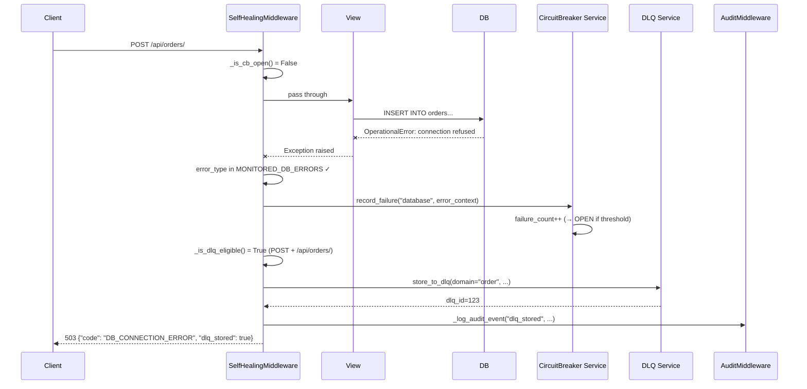
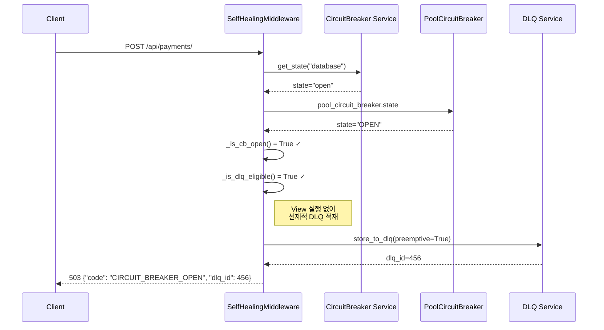
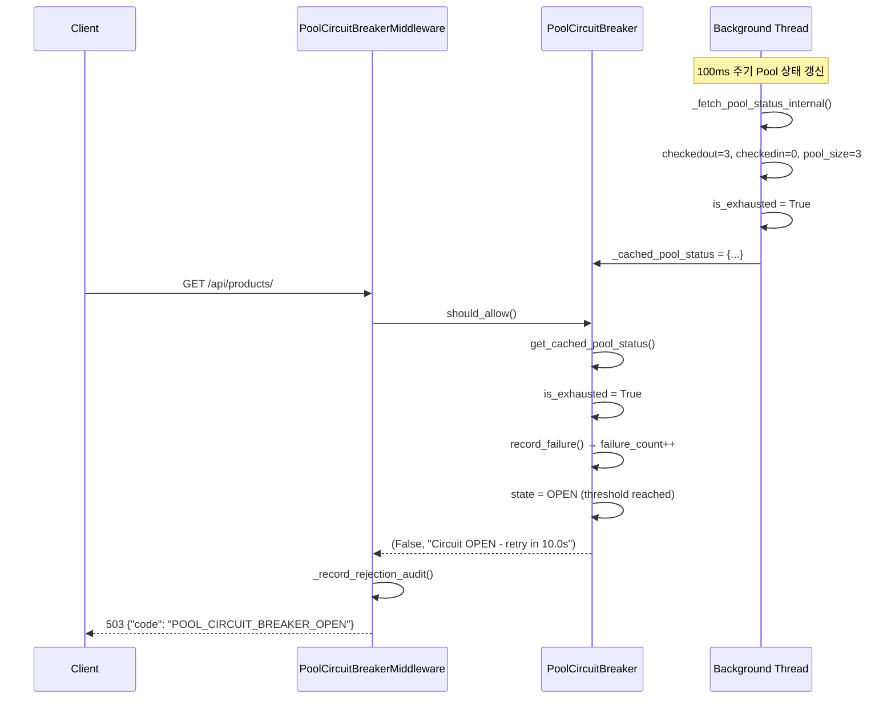

# Phase 5 결과 보고서 (2/3): 예외 발생 흐름도

> **생성일**: 2026-01-04
> **Phase**: 5 (전체 흐름도 작성)
> **상태**: ✅ 완료
> **문서 분류**: 예외 발생 흐름

---

## 📋 요약

이 문서는 Self-Healing 미들웨어 시스템의 **예외 발생 시 처리 흐름**을 코드 근거와 함께 설명합니다.

| 예외 유형 | 감지 미들웨어 | 응답 코드 | DLQ 적재 |
|----------|--------------|:---------:|:--------:|
| DB 연결 오류 | SelfHealingMiddleware | 503 | ✅ |
| Pool 고갈 | PoolCircuitBreakerMiddleware | 503 | ❌ |
| Pool Timeout | PoolTimeoutMiddleware | 503 | ❌ |
| Rate Limit 초과 | HybridRateLimitMiddleware | 429 | ❌ |
| Emergency 차단 | TieringMiddleware | 503 | ❌ |
| CB OPEN | SelfHealingMiddleware | 503 | ✅ (선제적) |

---

## 1. 예외 발생 흐름도 (전체)

```
┌─────────────────────────────────────────────────────────────────────────────┐
│                       예외 발생 흐름 (Exception Paths)                       │
├─────────────────────────────────────────────────────────────────────────────┤
│                                                                             │
│  HTTP Request 도착                                                          │
│       │                                                                     │
│       ▼                                                                     │
│  ┌─────────────────────────────────────────────────────────────────────┐   │
│  │ [3] TieringMiddleware                                               │   │
│  │     EmergencyLevel != NORMAL && multiplier == 0                     │   │
│  └─────────────────────────────────────────────────────────────────────┘   │
│       │ 차단 시                                                             │
│       ├──────────────────────────────────────────────────────────────────► │
│       │                                   503 Service Unavailable          │
│       │                                   "Load shedding active"           │
│       ▼ 통과 시                                                             │
│  ┌─────────────────────────────────────────────────────────────────────┐   │
│  │ [4] SelfHealingMiddleware (CB OPEN 체크)                            │   │
│  │     _is_cb_open() == True && _is_dlq_eligible(request)              │   │
│  └─────────────────────────────────────────────────────────────────────┘   │
│       │ CB OPEN 시                                                          │
│       ├──────────────────────────────────────────────────────────────────► │
│       │                                   503 Service Unavailable          │
│       │                                   + 선제적 DLQ 적재                 │
│       │                                   "CIRCUIT_BREAKER_OPEN"           │
│       ▼ 통과 시                                                             │
│  ┌─────────────────────────────────────────────────────────────────────┐   │
│  │ [14] HybridRateLimitMiddleware                                      │   │
│  │     is_allowed() == False                                           │   │
│  └─────────────────────────────────────────────────────────────────────┘   │
│       │ 초과 시                                                             │
│       ├──────────────────────────────────────────────────────────────────► │
│       │                                   429 Too Many Requests            │
│       │                                   "Rate limit exceeded"            │
│       ▼ 통과 시                                                             │
│  ┌─────────────────────────────────────────────────────────────────────┐   │
│  │ [15] PoolCircuitBreakerMiddleware                                   │   │
│  │     should_allow() == (False, reason)                               │   │
│  └─────────────────────────────────────────────────────────────────────┘   │
│       │ 차단 시                                                             │
│       ├──────────────────────────────────────────────────────────────────► │
│       │                                   503 Service Unavailable          │
│       │                                   "Pool exhausted, circuit OPEN"   │
│       ▼ 통과 시                                                             │
│  ┌─────────────────────────────────────────────────────────────────────┐   │
│  │ [16] PoolTimeoutMiddleware                                          │   │
│  │     SQLAlchemy TimeoutError 감지                                    │   │
│  └─────────────────────────────────────────────────────────────────────┘   │
│       │                                                                     │
│       ▼                                                                     │
│  ╔═════════════════════════════════════════════════════════════════════╗   │
│  ║                         [VIEW 실행]                                 ║   │
│  ║              DB 오류 발생 가능 지점                                  ║   │
│  ╚═════════════════════════════════════════════════════════════════════╝   │
│       │                                                                     │
│       ├─── DB Exception 발생 ──►┌────────────────────────────────────────┐ │
│       │                         │ [4] SelfHealingMiddleware              │ │
│       │                         │     except Exception 블록              │ │
│       │                         │     → CB 실패 기록                     │ │
│       │                         │     → DLQ 적재 (조건 충족 시)          │ │
│       │                         │     → 503 응답 반환                    │ │
│       │                         └────────────────────────────────────────┘ │
│       │                                                                     │
│       ├─── Pool Timeout ──────►┌────────────────────────────────────────┐  │
│       │                         │ [16] PoolTimeoutMiddleware             │ │
│       │                         │     _is_pool_timeout_error()           │ │
│       │                         │     → 503 응답 반환                    │ │
│       │                         └────────────────────────────────────────┘ │
│       │                                                                     │
│       ▼ 정상 응답                                                           │
│  ┌─────────────────────────────────────────────────────────────────────┐   │
│  │ [4] SelfHealingMiddleware (응답 단계)                               │   │
│  │     response.status_code in {502, 503, 504}                         │   │
│  └─────────────────────────────────────────────────────────────────────┘   │
│       │ 5xx 감지 시                                                         │
│       ├──────────────────────────────────────────────────────────────────► │
│       │                                   CB 실패 기록                      │
│       │                                   DLQ 적재 (조건 충족 시)           │
│       │                                   원본 5xx 응답 반환                │
│       ▼                                                                     │
│  HTTP Response (Error)                                                      │
│                                                                             │
└─────────────────────────────────────────────────────────────────────────────┘
```

---

## 2. 예외 유형별 상세 코드 근거

### 2.1 DB 연결 오류 (SelfHealingMiddleware)

**파일**: `packages/selfhealing-python/src/selfhealing/api/django/middleware.py`

```python
# Line 617-625: 감시 대상 정의
MONITORED_STATUS_CODES = {502, 503, 504}

MONITORED_DB_ERRORS = (
    "OperationalError",    # DB 연결 오류, 쿼리 실패
    "InterfaceError",      # DB 인터페이스 오류
    "DatabaseError",       # 일반 DB 오류
    "ConnectionDoesNotExist",  # Django 커넥션 미존재
)

# Line 785-812: DB 예외 처리 (except 블록)
try:
    response = self.get_response(request)

except Exception as e:
    error_type = type(e).__name__

    if error_type in self.MONITORED_DB_ERRORS or self._is_db_connection_error(e):
        db_error_context = {
            "error_type": error_type,
            "error_message": str(e),
            "path": request.path,
            "method": request.method,
        }

        # CircuitBreaker에 실패 기록
        self._record_cb_failure(db_error_context, request=request)

        # DLQ에 적재 (복구 가능한 요청인 경우)
        if self._is_dlq_eligible(request):
            self._store_to_dlq(request_data, db_error_context, request=request)

        # 503 응답 반환
        return JsonResponse(
            {
                "error": "Service temporarily unavailable",
                "code": "DB_CONNECTION_ERROR",
                "retry_after": 30,
                "dlq_stored": self._is_dlq_eligible(request),
            },
            status=503,
        )

    # DB 오류가 아닌 경우 다시 raise
    raise

# Line 857-874: DB 연결 오류 추가 판별
def _is_db_connection_error(self, error: Exception) -> bool:
    """Check if the error is a DB connection related error."""
    error_str = str(error).lower()
    db_error_keywords = [
        "connection refused",
        "too many clients",
        "connection timed out",
        "could not connect",
        "server closed the connection",
        "connection reset",
        "pool exhausted",
        "no connection available",
    ]
    return any(keyword in error_str for keyword in db_error_keywords)
```

**처리 흐름**:
1. View 실행 중 DB 예외 발생
2. `except Exception` 블록에서 캐치
3. `MONITORED_DB_ERRORS` 또는 `_is_db_connection_error()` 매칭
4. CB에 실패 기록 → DLQ 적재 (조건 충족 시) → 503 반환

---

### 2.2 CB OPEN 시 선제적 DLQ 적재 (v6.1.0)

**파일**: `packages/selfhealing-python/src/selfhealing/api/django/middleware.py`

```python
# Line 730-773: CB OPEN 시 선제적 DLQ 적재
def __call__(self, request: "HttpRequest") -> "HttpResponse":
    ...
    self._lazy_init()
    request_data = self._capture_request_data(request)

    # v6.1.0: CB OPEN 상태에서 선제적 DLQ 적재 (자동 라우팅)
    if self._is_cb_open() and self._is_dlq_eligible(request):
        error_context = {
            "error_type": "CIRCUIT_BREAKER_OPEN",
            "error_message": "Circuit breaker is OPEN - request queued for later retry",
            "path": request.path,
            "method": request.method,
            "preemptive": True,  # 선제적 DLQ 적재 표시
        }

        dlq_id = self._store_to_dlq(request_data, error_context, request=request)

        logger.info(
            f"[SelfHealingMiddleware] 🔒 Preemptive DLQ: CB is OPEN, "
            f"request queued (dlq_id={dlq_id}, path={request.path})"
        )

        # Audit 로그 기록
        self._log_audit_event(
            "preemptive_dlq_stored",
            {
                "dlq_id": dlq_id,
                "reason": "circuit_breaker_open",
                "path": request.path,
            },
            request=request,
        )

        return JsonResponse(
            {
                "error": "Service temporarily unavailable",
                "code": "CIRCUIT_BREAKER_OPEN",
                "retry_after": 30,
                "dlq_stored": True,
                "dlq_id": dlq_id,
                "message": "Request has been queued for automatic retry when service recovers",
            },
            status=503,
        )
```

**v6.1.0 개선사항**:
- CB가 OPEN 상태이면 View 실행 없이 즉시 DLQ 적재
- 시스템 부하 감소 + 복구 후 자동 리플레이 보장

---

### 2.3 DLQ 적재 조건

**파일**: `packages/selfhealing-python/src/selfhealing/api/django/middleware.py`

```python
# Line 902-914: DLQ 적재 대상 판별
def _is_dlq_eligible(self, request: "HttpRequest") -> bool:
    """Check if request is eligible for DLQ storage."""
    # POST, PUT, PATCH 요청만 DLQ 적재 대상
    if request.method not in ("POST", "PUT", "PATCH"):
        return False

    # 경로 패턴 매칭
    for pattern in self.DLQ_ELIGIBLE_PATHS:
        if pattern.match(request.path):
            return True

    return False

# Line 670-700: 경로 패턴 로드 (Django settings에서)
@classmethod
def _load_path_patterns(cls) -> None:
    """Load path patterns from Django settings (Domain-Free)."""
    if cls._paths_loaded:
        return

    from django.conf import settings

    # DLQ 적재 대상 경로
    dlq_patterns = getattr(settings, "SELF_HEALING_DLQ_ELIGIBLE_PATHS", [])
    cls.DLQ_ELIGIBLE_PATHS = [re.compile(p) for p in dlq_patterns]

    # 인프라 장애 경로
    infra_patterns = getattr(settings, "SELF_HEALING_INFRA_FAILURE_PATHS", [])
    cls.INFRASTRUCTURE_FAILURE_PATHS = [re.compile(p) for p in infra_patterns]

    # 도메인 매핑
    cls.DOMAIN_MAPPING = getattr(settings, "SELF_HEALING_DOMAIN_MAPPING", {})

    cls._paths_loaded = True
```

**DLQ 적재 조건**:
1. HTTP Method: `POST`, `PUT`, `PATCH` 만
2. 경로: `SELF_HEALING_DLQ_ELIGIBLE_PATHS` 패턴에 매칭

**settings.py 설정 예시**:
```python
SELF_HEALING_DLQ_ELIGIBLE_PATHS = [
    r"^/api/orders/",
    r"^/api/payments/",
    r"^/api/cart/",
]
```

---

### 2.4 HTTP 5xx 응답 감지

**파일**: `packages/selfhealing-python/src/selfhealing/api/django/middleware.py`

```python
# Line 820-855: HTTP 5xx 응답 처리
# HTTP 5xx 응답 감지
if response.status_code in self.MONITORED_STATUS_CODES:
    # v6.1.0: 인프라 장애 경로 여부 확인
    is_infra_failure_path = self._is_infrastructure_failure_path(request)

    error_context = {
        "error_type": f"HTTP_{response.status_code}",
        "error_message": f"Server returned {response.status_code}",
        "path": request.path,
        "method": request.method,
        "infrastructure_failure": is_infra_failure_path,
    }

    # CircuitBreaker에 실패 기록
    self._record_cb_failure(error_context, request=request)

    if is_infra_failure_path:
        logger.warning(
            f"[SelfHealingMiddleware] 🔥 INFRA FAILURE detected: "
            f"path={request.path}, status={response.status_code}"
        )

    # DLQ에 적재 (복구 가능한 요청인 경우)
    if self._is_dlq_eligible(request):
        self._store_to_dlq(request_data, error_context, request=request)

else:
    # 성공 응답일 경우 CircuitBreaker에 성공 기록
    if response.status_code < 400:
        self._record_cb_success()

return response

# Line 916-926: 인프라 장애 경로 판별
def _is_infrastructure_failure_path(self, request: "HttpRequest") -> bool:
    """
    Check if request path is an infrastructure failure path.
    v6.1.0: 이 경로들에서 503이 발생하면 "진짜 인프라 장애"로 취급
    """
    for pattern in self.INFRASTRUCTURE_FAILURE_PATHS:
        if pattern.match(request.path):
            return True
    return False
```

**v6.1.0 인프라 장애 인식**:
- `SELF_HEALING_INFRA_FAILURE_PATHS`에 정의된 경로에서 5xx 발생 시
- "진짜 인프라 장애"로 인식하여 CB 실패를 더 강하게 기록

---

### 2.5 Pool 고갈 (PoolCircuitBreakerMiddleware)

**파일**: `packages/selfhealing-python/src/selfhealing/api/django/pool_circuit_breaker.py`

```python
# Line 573-620: 미들웨어 제외 경로
EXCLUDED_PATHS = [
    "/health/",
    "/api/self-healing/health/",
    "/api/self-healing/circuit-breaker/",  # CB 관리 API는 제외
    "/admin/",
    "/static/",
    "/media/",
]

# Line 650-720: 요청 처리 로직
def __call__(self, request):
    # 비활성화 시 바이패스
    if not self._enabled:
        return self.get_response(request)

    # 제외 경로 체크
    if self._should_exclude(request.path):
        return self.get_response(request)

    # Pool Circuit Breaker 체크
    allowed, reason = pool_circuit_breaker.should_allow()

    if not allowed:
        # Audit 기록 (v6.2.1)
        if self._audit_enabled:
            self._record_rejection_audit(
                request=request,
                reason=reason,
                circuit_state=pool_circuit_breaker.state,
                pool_status=pool_circuit_breaker.get_cached_pool_status(),
            )

        return JsonResponse(
            {
                "error": "Service temporarily unavailable",
                "code": "POOL_CIRCUIT_BREAKER_OPEN",
                "reason": reason,
                "state": pool_circuit_breaker.state,
                "retry_after": pool_circuit_breaker._recovery_timeout,
            },
            status=503,
        )

    # 요청 처리
    try:
        response = self.get_response(request)

        # 성공 시 CB에 기록
        if response.status_code < 500:
            pool_circuit_breaker.record_success()
        else:
            pool_circuit_breaker.record_failure()

        return response

    except Exception as e:
        pool_circuit_breaker.record_failure()
        raise
```

**Pool 상태 체크** (캐시 기반):

```python
# Line 477-520: should_allow() 메서드
def should_allow(self) -> Tuple[bool, Optional[str]]:
    """요청을 허용할지 결정 (캐시 기반, Non-Blocking)"""
    self._stats["total_requests"] += 1

    # 캐시에서 Pool 상태 조회
    cached_status = self.get_cached_pool_status()

    # Pool 고갈 감지
    if cached_status.get("is_exhausted", False):
        self.record_failure()

    current_state = self._state

    if current_state == self.CLOSED:
        return (True, None)

    elif current_state == self.OPEN:
        if self._open_time and (time.time() - self._open_time) >= self._recovery_timeout:
            self._set_state(self.HALF_OPEN)
            return (True, "Testing recovery (HALF_OPEN)")

        remaining = self._recovery_timeout - (time.time() - (self._open_time or 0))
        return (False, f"Circuit OPEN - retry in {remaining:.1f}s")

    elif current_state == self.HALF_OPEN:
        if self._half_open_requests < self._half_open_max_requests:
            self._half_open_requests += 1
            return (True, "Testing recovery (HALF_OPEN)")
        else:
            return (False, "HALF_OPEN test in progress - wait")

    return (True, None)
```

---

### 2.6 Pool Timeout (PoolTimeoutMiddleware)

**파일**: `myproject/middleware/pool_timeout_middleware.py`

```python
# SQLAlchemy TimeoutError import
try:
    from sqlalchemy.exc import TimeoutError as SATimeoutError
    SQLALCHEMY_AVAILABLE = True
except ImportError:
    SATimeoutError = Exception
    SQLALCHEMY_AVAILABLE = False

# 감지 패턴
def _is_pool_timeout_error(self, error: Exception) -> bool:
    """Pool Timeout 에러인지 판별"""
    error_str = str(error).lower()
    timeout_keywords = [
        "timeout",
        "queuepool limit",
        "pool exhausted",
        "no connections available",
    ]
    return any(keyword in error_str for keyword in timeout_keywords)

def __call__(self, request):
    if not self._enabled:
        return self.get_response(request)

    try:
        response = self.get_response(request)
        return response
    except Exception as e:
        if self._is_pool_timeout_error(e):
            logger.warning(
                f"[PoolTimeoutMiddleware] Pool timeout detected: {e}"
            )
            return JsonResponse(
                {
                    "error": "Service temporarily unavailable",
                    "code": "POOL_TIMEOUT",
                    "message": "Database connection pool timeout",
                    "retry_after": 30,
                },
                status=503,
            )
        raise
```

---

### 2.7 Rate Limit 초과 (HybridRateLimitMiddleware)

**파일**: `packages/selfhealing-python/src/selfhealing/api/django/rate_limit.py`

```python
# 미들웨어 처리 로직 (간략화)
def __call__(self, request):
    # /api/self-healing/* 경로만 체크
    if not request.path.startswith(CONTROL_API_PATH_PREFIX):
        return self.get_response(request)

    # Rate limit 키 생성 (IP + User)
    key = self._get_rate_limit_key(request)

    # Redis 체크 (Primary)
    try:
        is_allowed, remaining = self._redis_rate_limiter.is_allowed(key)
        if not is_allowed:
            return self._rate_limit_response(
                request=request,
                remaining=0,
                mode="normal",
            )
    except RedisError:
        # Redis 실패 → Local Memory (Fallback)
        is_allowed, remaining = self._local_rate_limiter.is_allowed(key)
        if not is_allowed:
            return self._rate_limit_response(
                request=request,
                remaining=0,
                mode="emergency",
            )

    return self.get_response(request)

def _rate_limit_response(self, request, remaining, mode):
    """Rate limit 초과 응답"""
    return JsonResponse(
        {
            "error": "Too Many Requests",
            "code": "RATE_LIMIT_EXCEEDED",
            "mode": mode,
            "retry_after": 60,
        },
        status=429,
    )
```

---

### 2.8 Emergency 모드 차단 (TieringMiddleware)

**파일**: `packages/selfhealing-python/src/selfhealing/api/django/tiering/middleware.py`

```python
# Line 132-160: Load Shedding 응답 생성
def _create_load_shedding_response(
    self,
    request,
    tier_id: str,
    multiplier: float,
    emergency_level,
):
    """Load shedding 응답 생성"""
    from django.http import JsonResponse

    response_data = {
        "error": "Service temporarily unavailable",
        "code": "LOAD_SHEDDING",
        "tier": tier_id,
        "multiplier": multiplier,
        "emergency_level": emergency_level.value,
        "message": f"Request blocked due to emergency level {emergency_level.name}",
        "retry_after": 30,
    }

    logger.warning(
        f"[TieringMiddleware] Load shedding: "
        f"path={request.path}, tier={tier_id}, "
        f"level={emergency_level.name}, multiplier={multiplier}"
    )

    return JsonResponse(response_data, status=503)

# Line 120-130: 확률적 차단 결정
def _should_allow_request(self, multiplier: float) -> bool:
    """
    확률적으로 요청 허용 여부 결정.

    multiplier=1.0 → 100% 허용
    multiplier=0.5 → 50% 허용
    multiplier=0.0 → 100% 차단
    """
    if multiplier >= 1.0:
        return True
    if multiplier <= 0.0:
        return False
    return self._random.random() < multiplier
```

---

## 3. 예외 흐름 시퀀스 다이어그램

### 3.1 DB 오류 시 흐름



### 3.2 CB OPEN 시 선제적 DLQ



### 3.3 Pool 고갈 시 흐름



---

## 4. CB 실패 기록 흐름

**파일**: `packages/selfhealing-python/src/selfhealing/api/django/middleware.py`

```python
# Line 964-1010: CB 실패 기록
def _record_cb_failure(
    self,
    error_context: Dict[str, Any],
    request: Optional["HttpRequest"] = None,
) -> None:
    """Record failure to CircuitBreaker."""
    try:
        if self._cb_service and self._cb_service.is_enabled:
            self._cb_service.record_failure(
                self.CB_SERVICE_NAME,  # "database"
                error_context=error_context,
            )
            logger.info(
                f"[SelfHealingMiddleware] CB failure recorded: "
                f"service={self.CB_SERVICE_NAME}, "
                f"error_type={error_context.get('error_type')}"
            )

            # Audit 로그 기록 (버퍼 패턴)
            self._log_audit_event(
                "cb_failure_recorded",
                {
                    "service": self.CB_SERVICE_NAME,
                    "error_context": error_context,
                },
                request=request,
            )
    except Exception as e:
        logger.error(f"[SelfHealingMiddleware] CB failure recording failed: {e}")

    # v6.1.0: PoolCircuitBreaker도 함께 실패 기록 (테스트 가시성)
    try:
        from selfhealing.api.django.pool_circuit_breaker import pool_circuit_breaker

        pool_circuit_breaker.record_failure()
        logger.info(
            f"[SelfHealingMiddleware] PoolCB failure recorded: "
            f"state={pool_circuit_breaker.state}, failures={pool_circuit_breaker._failure_count}"
        )
    except Exception as e:
        logger.warning(f"[SelfHealingMiddleware] PoolCB record_failure failed: {e}")
```

---

## 5. 예외 유형별 응답 정리

| 예외 유형 | HTTP 코드 | code 필드 | DLQ 적재 | CB 기록 |
|----------|:---------:|-----------|:--------:|:-------:|
| DB Exception | 503 | `DB_CONNECTION_ERROR` | ✅ (조건) | ✅ |
| CB OPEN (선제적) | 503 | `CIRCUIT_BREAKER_OPEN` | ✅ | ❌ |
| HTTP 5xx 응답 | 원본 | `HTTP_{code}` | ✅ (조건) | ✅ |
| Pool 고갈 | 503 | `POOL_CIRCUIT_BREAKER_OPEN` | ❌ | ✅ (Pool) |
| Pool Timeout | 503 | `POOL_TIMEOUT` | ❌ | ❌ |
| Rate Limit | 429 | `RATE_LIMIT_EXCEEDED` | ❌ | ❌ |
| Emergency 차단 | 503 | `LOAD_SHEDDING` | ❌ | ❌ |

---

## 📚 관련 문서

- [14_PHASE5_NORMAL_REQUEST_FLOW.md](14_PHASE5_NORMAL_REQUEST_FLOW.md) - 정상 요청 흐름도
- [16_PHASE5_AUTO_RECOVERY_FLOW.md](16_PHASE5_AUTO_RECOVERY_FLOW.md) - 자동 복구 흐름도
- [11_PHASE2_MIDDLEWARE_ANALYSIS_RESULT.md](11_PHASE2_MIDDLEWARE_ANALYSIS_RESULT.md) - 미들웨어 분석
- [12_PHASE4_FEATURE_FLAG_RESULT.md](12_PHASE4_FEATURE_FLAG_RESULT.md) - Feature Flag 정리

---

*이 문서는 Phase 5 전체 흐름도 작성의 결과물입니다. (2/3)*
