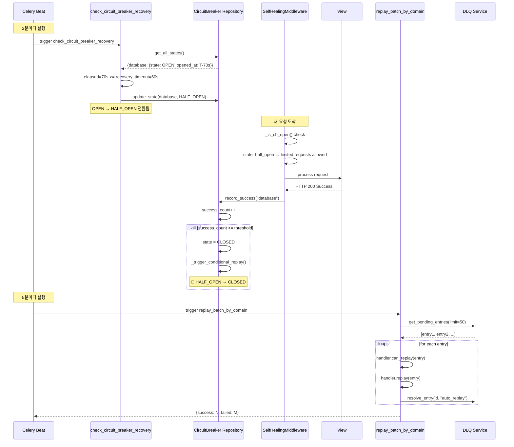

# Phase 5 결과 보고서 (3/3): 자동 복구 흐름도

> **생성일**: 2026-01-04
> **Phase**: 5 (전체 흐름도 작성)
> **상태**: ✅ 완료
> **문서 분류**: 자동 복구 흐름

---

## 📋 요약

이 문서는 Self-Healing 미들웨어 시스템의 **자동 복구 메커니즘**을 코드 근거와 함께 설명합니다.

| 복구 메커니즘 | 트리거 | 주기 | 코드 위치 |
|-------------|--------|:----:|-----------|
| CB 상태 전이 | Celery Beat | 2분 | `tasks.py:339-400` |
| DLQ 리플레이 | Celery Beat | 5분 | `beat_schedule.py:150-156` |
| Pool CB 복구 | 백그라운드 스레드 | 100ms | `pool_circuit_breaker.py:160-200` |

---

## 1. 자동 복구 전체 흐름도

```
┌─────────────────────────────────────────────────────────────────────────────┐
│                          자동 복구 흐름 (Auto Recovery)                      │
├─────────────────────────────────────────────────────────────────────────────┤
│                                                                             │
│  ╔═══════════════════════════════════════════════════════════════════════╗  │
│  ║           STEP 1: Circuit Breaker 상태 전이 (2분 주기)                 ║  │
│  ╠═══════════════════════════════════════════════════════════════════════╣  │
│  ║                                                                       ║  │
│  ║  Celery Beat (check-circuit-breaker-recovery-legacy)                  ║  │
│  ║       │                                                               ║  │
│  ║       ▼                                                               ║  │
│  ║  ┌───────────────────────────────────────────────────────────────┐   ║  │
│  ║  │ check_circuit_breaker_recovery() Task                         │   ║  │
│  ║  │                                                               │   ║  │
│  ║  │  for each service in cb_repo.get_all_states():                │   ║  │
│  ║  │      if state == OPEN                                         │   ║  │
│  ║  │         && not manually_controlled                            │   ║  │
│  ║  │         && elapsed >= recovery_timeout:                       │   ║  │
│  ║  │                                                               │   ║  │
│  ║  │          cb_repo.update_state(                                │   ║  │
│  ║  │              service_name=service,                            │   ║  │
│  ║  │              state=HALF_OPEN,                                 │   ║  │
│  ║  │              success_count=0                                  │   ║  │
│  ║  │          )                                                    │   ║  │
│  ║  └───────────────────────────────────────────────────────────────┘   ║  │
│  ║       │                                                               ║  │
│  ║       ▼                                                               ║  │
│  ║  OPEN ──recovery_timeout(60s)──► HALF_OPEN                            ║  │
│  ║                                                                       ║  │
│  ╚═══════════════════════════════════════════════════════════════════════╝  │
│       │                                                                     │
│       ▼                                                                     │
│  ╔═══════════════════════════════════════════════════════════════════════╗  │
│  ║           STEP 2: 테스트 요청 처리 (HALF_OPEN 상태)                    ║  │
│  ╠═══════════════════════════════════════════════════════════════════════╣  │
│  ║                                                                       ║  │
│  ║  새 요청 도착 (SelfHealingMiddleware)                                 ║  │
│  ║       │                                                               ║  │
│  ║       ▼                                                               ║  │
│  ║  ┌───────────────────────────────────────────────────────────────┐   ║  │
│  ║  │ _is_cb_open() 체크                                            │   ║  │
│  ║  │                                                               │   ║  │
│  ║  │  cb_service.get_state("database")                             │   ║  │
│  ║  │      → state = "half_open"                                    │   ║  │
│  ║  │      → return True (CB still not fully closed)                │   ║  │
│  ║  │                                                               │   ║  │
│  ║  │  BUT: HALF_OPEN allows limited test requests                  │   ║  │
│  ║  │       (up to half_open_max_requests)                          │   ║  │
│  ║  └───────────────────────────────────────────────────────────────┘   ║  │
│  ║       │                                                               ║  │
│  ║       ├─── 성공 ───►  _record_cb_success()                            ║  │
│  ║       │                  success_count++                              ║  │
│  ║       │                  if success_count >= success_threshold:       ║  │
│  ║       │                      state = CLOSED ─────────────────────────►║  │
│  ║       │                      _trigger_conditional_replay()            ║  │
│  ║       │                                                               ║  │
│  ║       └─── 실패 ───►  _record_cb_failure()                            ║  │
│  ║                         state = OPEN (back to blocked)                ║  │
│  ║                                                                       ║  │
│  ╚═══════════════════════════════════════════════════════════════════════╝  │
│       │                                                                     │
│       ▼                                                                     │
│  ╔═══════════════════════════════════════════════════════════════════════╗  │
│  ║           STEP 3: DLQ 자동 리플레이 (5분 주기)                         ║  │
│  ╠═══════════════════════════════════════════════════════════════════════╣  │
│  ║                                                                       ║  │
│  ║  Celery Beat (replay-failed-operations)                               ║  │
│  ║       │                                                               ║  │
│  ║       ▼                                                               ║  │
│  ║  ┌───────────────────────────────────────────────────────────────┐   ║  │
│  ║  │ replay_batch_by_domain() Task                                 │   ║  │
│  ║  │                                                               │   ║  │
│  ║  │  entries = dlq_service.get_pending_entries(limit=50)          │   ║  │
│  ║  │                                                               │   ║  │
│  ║  │  for entry in entries:                                        │   ║  │
│  ║  │      handler = get_replay_handler(entry.domain)               │   ║  │
│  ║  │      can_replay, reason = handler.can_replay(entry)           │   ║  │
│  ║  │                                                               │   ║  │
│  ║  │      if can_replay:                                           │   ║  │
│  ║  │          result = handler.replay(entry)                       │   ║  │
│  ║  │          if result.success:                                   │   ║  │
│  ║  │              dlq_service.resolve_entry(entry.id, "auto_replay")│   ║  │
│  ║  └───────────────────────────────────────────────────────────────┘   ║  │
│  ║                                                                       ║  │
│  ╚═══════════════════════════════════════════════════════════════════════╝  │
│       │                                                                     │
│       ▼                                                                     │
│  ╔═══════════════════════════════════════════════════════════════════════╗  │
│  ║           STEP 4: 조건부 리플레이 (CB CLOSED 시 트리거)                ║  │
│  ╠═══════════════════════════════════════════════════════════════════════╣  │
│  ║                                                                       ║  │
│  ║  CB가 HALF_OPEN → CLOSED 전환 시                                      ║  │
│  ║       │                                                               ║  │
│  ║       ▼                                                               ║  │
│  ║  ┌───────────────────────────────────────────────────────────────┐   ║  │
│  ║  │ _trigger_conditional_replay(service_name)                     │   ║  │
│  ║  │                                                               │   ║  │
│  ║  │  "서비스가 복구되었으니 대기 중인 DLQ 즉시 리플레이"           │   ║  │
│  ║  │                                                               │   ║  │
│  ║  │  → 해당 도메인의 pending 항목만 선별 리플레이                 │   ║  │
│  ║  └───────────────────────────────────────────────────────────────┘   ║  │
│  ║                                                                       ║  │
│  ╚═══════════════════════════════════════════════════════════════════════╝  │
│       │                                                                     │
│       ▼                                                                     │
│  시스템 완전 복구 (CLOSED 상태, DLQ 비움)                                   │
│                                                                             │
└─────────────────────────────────────────────────────────────────────────────┘
```

---

## 2. Circuit Breaker 상태 전이 상세

### 2.1 상태 다이어그램

```
┌─────────────────────────────────────────────────────────────────────────────┐
│                     Circuit Breaker 상태 전이 다이어그램                     │
├─────────────────────────────────────────────────────────────────────────────┤
│                                                                             │
│                          success_count >= threshold                         │
│                    ┌─────────────────────────────────────┐                  │
│                    │                                     ▼                  │
│              ┌─────┴─────┐                        ┌───────────┐             │
│              │           │                        │           │             │
│      ┌──────►│ HALF_OPEN │◄───────────────────────│  CLOSED   │◄────┐      │
│      │       │           │   failure detected     │  (정상)   │     │      │
│      │       └─────┬─────┘                        └───────────┘     │      │
│      │             │                                    │           │      │
│      │             │ failure detected                   │           │      │
│      │             │                                    │           │      │
│      │             ▼                                    │           │      │
│      │       ┌───────────┐   failure_count >=           │           │      │
│      │       │           │   failure_threshold          │           │      │
│      │       │   OPEN    │◄─────────────────────────────┘           │      │
│      │       │  (차단)   │                                          │      │
│      │       └─────┬─────┘                                          │      │
│      │             │                                                │      │
│      │             │ elapsed >= recovery_timeout                    │      │
│      │             │ (Celery Task에서 체크)                         │      │
│      └─────────────┘                                                │      │
│                                                                     │      │
│                              manual_control("close")                │      │
│                    ─────────────────────────────────────────────────┘      │
│                                                                             │
└─────────────────────────────────────────────────────────────────────────────┘
```

### 2.2 Celery Beat 스케줄 (코드 근거)

**파일**: `packages/selfhealing-python/src/selfhealing/adapters/celery/beat_schedule.py`

```python
# Line 150-165: Legacy 스케줄 정의
def _get_legacy_beat_schedule() -> Dict[str, Any]:
    """Legacy tasks from existing adapters/celery/tasks.py."""
    from celery.schedules import crontab

    return {
        # DLQ Replay - 5분마다
        "replay-failed-operations": {
            "task": "selfhealing.adapters.celery.tasks.replay_batch_by_domain",
            "schedule": crontab(minute="*/5"),
            "options": {"queue": "dlq"},
            "kwargs": {"max_entries": 50},
        },
        # Circuit Breaker Recovery Check - 2분마다
        "check-circuit-breaker-recovery-legacy": {
            "task": "selfhealing.adapters.celery.tasks.check_circuit_breaker_recovery",
            "schedule": crontab(minute="*/2"),
            "options": {"queue": "realtime"},
        },
        # Manual Override Expiry - 10분마다
        "expire-manual-overrides": {
            "task": "selfhealing.adapters.celery.tasks.expire_manual_overrides",
            "schedule": crontab(minute="*/10"),
            "options": {"queue": "maintenance"},
        },
    }
```

### 2.3 CB Recovery Check Task (코드 근거)

**파일**: `packages/selfhealing-python/src/selfhealing/adapters/celery/tasks.py`

```python
# Line 339-400: check_circuit_breaker_recovery Task
@shared_task(
    bind=True,
    name="selfhealing.adapters.celery.tasks.check_circuit_breaker_recovery",
    queue="maintenance",
    max_retries=1,
    time_limit=60,
    soft_time_limit=55,
)
def check_circuit_breaker_recovery(self) -> dict:
    """
    Periodic task to check for circuit breaker state transitions.

    Checks if any circuit breakers in OPEN state should transition
    to HALF_OPEN based on recovery timeout.
    """
    logger.debug("[Circuit Check] Checking for circuit breakers to transition")

    try:
        from selfhealing.factory import ProviderRegistry
        from selfhealing.core.types import CircuitState
        from selfhealing.core.timezone import now

        cb_repo = ProviderRegistry.get_circuit_breaker_repo()
        current_time = now()
        transitioned = []

        # Get all circuit breaker states from Redis
        all_states = cb_repo.get_all_states()

        for service_name, state in all_states.items():
            # Skip if not OPEN or manually controlled
            if state.state != CircuitState.OPEN:
                continue
            if getattr(state, "manually_controlled", False):
                continue
            if not state.opened_at:
                continue

            # Check if recovery timeout has passed
            elapsed = (current_time - state.opened_at).total_seconds()
            recovery_timeout = getattr(state, "recovery_timeout", 60)

            if elapsed >= recovery_timeout:
                # Transition to HALF_OPEN
                success = cb_repo.update_state(
                    service_name=service_name,
                    state=CircuitState.HALF_OPEN,
                    half_opened_at=current_time,
                    success_count=0,
                    half_open_request_count=0,
                )

                if success:
                    transitioned.append(service_name)
                    logger.info(
                        f"[Circuit Check] Transitioned '{service_name}' "
                        f"from OPEN to HALF_OPEN after {elapsed:.0f}s"
                    )

        return {
            "success": True,
            "transitioned": transitioned,
            "count": len(transitioned),
        }

    except Exception as e:
        logger.error(f"[Circuit Check] Error: {e}", exc_info=True)
        return {
            "success": False,
            "error": str(e),
        }
```

---

## 3. HALF_OPEN → CLOSED 전이 (성공 기록)

### 3.1 CircuitBreaker Service 코드 근거

**파일**: `packages/selfhealing-python/src/selfhealing/services/circuit_breaker/service.py`

```python
# Line 600-630: record_success() 메서드
def record_success(self, service_name: str) -> None:
    """Record a successful call for the circuit breaker."""
    if not self.is_enabled:
        return

    state = self.repository.get_state(service_name)
    if state is None:
        return

    circuit_closed = False

    if state.state == "half_open":
        # Increment success count
        new_count = state.success_count + 1
        self.repository.update_state(
            service_name=service_name,
            success_count=new_count,
        )

        if new_count >= self.config.success_threshold:
            # Enough successes - close the circuit!
            self.repository.update_state(
                service_name=service_name,
                state="closed",
                failure_count=0,
                success_count=0,
                opened_at=None,
            )
            circuit_closed = True

    elif state.state == "closed":
        # Reset failure count on success in closed state
        self.repository.update_state(
            service_name=service_name,
            state="closed",
            failure_count=0,
        )

    if circuit_closed:
        logger.info(
            f"[CircuitBreaker] Circuit auto-closed for '{service_name}' "
            f"(successes: {self.config.success_threshold})"
        )
        # Trigger conditional replay on auto-close
        self._trigger_conditional_replay(service_name)
```

### 3.2 조건부 리플레이 트리거

```python
# _trigger_conditional_replay 메서드 (service.py 내)
def _trigger_conditional_replay(self, service_name: str) -> None:
    """
    서비스가 복구되면 해당 도메인의 DLQ 항목을 즉시 리플레이.

    CB가 HALF_OPEN → CLOSED로 전환될 때 호출됨.
    """
    try:
        # Phase 3: Push 이벤트 - CB 상태 변경 메트릭 기록
        from selfhealing.metrics.event_handlers import CircuitBreakerEventHandler
        CircuitBreakerEventHandler.on_state_changed(
            service=service_name,
            from_state="half_open",
            to_state="closed",
        )
    except ImportError:
        pass

    # 조건부 리플레이 태스크 트리거
    # (해당 도메인의 pending DLQ만 선별 리플레이)
```

---

## 4. DLQ 자동 리플레이 상세

### 4.1 DLQ Service 리플레이 로직

**파일**: `packages/selfhealing-python/src/selfhealing/services/dlq_service.py`

```python
# Line 488-550: replay() 메서드
def replay(
    self,
    domain: Optional[str] = None,
    batch_size: int = 50,
    request: Any = None,
) -> ReplayResult:
    """
    Execute batch replay of pending DLQ entries.

    Phase 2 하이브리드 로직:
    - request가 있으면 → RequestAuditBuffer에 적재
    - request가 없으면 → 직접 adapter 호출 (Celery 등 비동기 컨텍스트)
    """
    result = ReplayResult()

    try:
        entries = self.get_pending_entries(domain=domain, limit=batch_size)
        result.processed = len(entries)

        for entry in entries:
            try:
                # Execute replay via registered handler
                replay_success = self._execute_replay(entry)

                if replay_success:
                    self.resolve_entry(entry.id, "auto_replay")
                    result.success += 1
                    logger.info(
                        f"[DLQService] Successfully replayed entry {entry.id}: "
                        f"{entry.domain}/{entry.failure_type}"
                    )
                    # Audit 로깅: Replay 성공
                    self._log_dlq_audit(
                        action="replay",
                        dlq_id=entry.id,
                        domain=entry.domain,
                        success=True,
                        request=request,
                    )
                else:
                    result.failed += 1
                    result.errors.append(f"Entry {entry.id}: Replay handler returned failure")
                    # Audit 로깅: Replay 실패
                    self._log_dlq_audit(
                        action="replay",
                        dlq_id=entry.id,
                        domain=entry.domain,
                        success=False,
                        error_message="Replay handler returned failure",
                        request=request,
                    )
            except Exception as e:
                result.failed += 1
                result.errors.append(f"Entry {entry.id}: {str(e)}")
                logger.warning(
                    f"[DLQService] Replay failed for entry {entry.id}: {e}"
                )
    except Exception as e:
        result.error = str(e)
        logger.error(f"[DLQService] Replay batch error: {e}")

    return result

# Line 461-485: _execute_replay() 메서드
def _execute_replay(self, entry: "FailedOperationData") -> bool:
    """
    Execute replay for a single DLQ entry using registered handler.
    """
    from selfhealing.services.replay_service import get_replay_handler

    handler = get_replay_handler(entry.domain)

    # Check if replay is allowed
    can_replay, reason = handler.can_replay(entry)
    if not can_replay:
        logger.warning(
            f"[DLQService] Replay not allowed for entry {entry.id}: {reason}"
        )
        return False

    # Execute replay
    result = handler.replay(entry)
    return result.success
```

### 4.2 리플레이 핸들러 체크

```python
# can_replay() 체크 항목:
# 1. max_retries 초과 여부 (기본 5회)
# 2. CB 상태 (OPEN이면 리플레이 불가)
# 3. 도메인별 커스텀 조건 (핸들러 구현에 따라)
```

---

## 5. Pool Circuit Breaker 복구 흐름

### 5.1 Pool CB 상태 전이

**파일**: `packages/selfhealing-python/src/selfhealing/api/django/pool_circuit_breaker.py`

```python
# Line 524-540: record_success() 메서드
def record_success(self):
    """요청 성공 기록"""
    with self._state_lock:
        if self._state == self.HALF_OPEN:
            self._success_count += 1
            logger.info(
                f"[PoolCircuitBreaker] HALF_OPEN success: "
                f"{self._success_count}/{self._success_threshold}"
            )

            if self._success_count >= self._success_threshold:
                # 충분히 성공 - 복구 완료!
                self._set_state(self.CLOSED)
                self._failure_count = 0
                self._success_count = 0
                logger.info("[PoolCircuitBreaker] 🎉 RECOVERED! Circuit CLOSED")

        elif self._state == self.CLOSED:
            # 정상 상태에서 성공 - 실패 카운터 리셋
            self._failure_count = 0

# Line 542-555: record_failure() 메서드
def record_failure(self):
    """요청 실패 기록"""
    with self._state_lock:
        self._last_failure_time = time.time()

        if self._state == self.HALF_OPEN:
            # 복구 테스트 실패 - 다시 OPEN
            self._set_state(self.OPEN)
            logger.warning("[PoolCircuitBreaker] Recovery failed - back to OPEN")

        elif self._state == self.CLOSED:
            self._failure_count += 1
            if self._failure_count >= self._failure_threshold:
                self._set_state(self.OPEN)
```

### 5.2 Pool 상태 갱신 (백그라운드 스레드)

```python
# Line 160-200: _background_refresh_loop() 메서드
def _background_refresh_loop(self):
    """백그라운드에서 주기적으로 Pool 상태 갱신"""
    interval_sec = self._cache_interval_ms / 1000.0  # 100ms
    consecutive_failures = 0

    while not self._stop_background.is_set():
        try:
            # Pool 상태 조회 (잠재적 블로킹)
            new_status = self._fetch_pool_status_internal()
            current_time = time.time()
            new_status["_cache_time"] = current_time
            new_status["_is_stale"] = False

            # 캐시 업데이트 (atomic swap)
            with self._cache_lock:
                self._cached_pool_status = new_status
                self._stats["cache_refreshes"] += 1
                self._last_successful_refresh = current_time

            consecutive_failures = 0

        except Exception as e:
            consecutive_failures += 1
            logger.debug(
                f"[PoolCircuitBreaker] Background refresh failed ({consecutive_failures}x): {e}"
            )

            if consecutive_failures >= 5:
                logger.warning(
                    f"[PoolCircuitBreaker] Background refresh failing consecutively"
                )

        # 다음 갱신까지 대기 (100ms)
        self._stop_background.wait(timeout=interval_sec)
```

---

## 6. 복구 흐름 시퀀스 다이어그램

### 6.1 전체 복구 시퀀스



---

## 7. 복구 관련 환경변수

| 환경변수 | 기본값 | 설명 |
|----------|:------:|------|
| `SELFHEALING_CB_RECOVERY_TIMEOUT` | `60` | OPEN→HALF_OPEN 대기 시간(초) |
| `SELFHEALING_CB_SUCCESS_THRESHOLD` | `2` | HALF_OPEN→CLOSED 성공 횟수 |
| `SELFHEALING_CB_FAILURE_THRESHOLD` | `5` | CLOSED→OPEN 실패 횟수 |
| `POOL_CB_RECOVERY_TIMEOUT` | `10` | Pool CB HALF_OPEN 대기(초) |
| `POOL_CB_SUCCESS_THRESHOLD` | `2` | Pool CB CLOSED 전환 성공 횟수 |
| `POOL_CB_FAILURE_THRESHOLD` | `3` | Pool CB OPEN 전환 실패 횟수 |
| `SELFHEALING_DLQ_MAX_RETRIES` | `5` | DLQ 최대 재시도 횟수 |

---

## 8. 복구 메커니즘 요약

```
┌─────────────────────────────────────────────────────────────────────────────┐
│                          복구 메커니즘 요약                                  │
├─────────────────────────────────────────────────────────────────────────────┤
│                                                                             │
│  ┌────────────────┐    ┌────────────────┐    ┌────────────────┐             │
│  │   장애 발생    │───►│   CB OPEN      │───►│   요청 차단    │             │
│  └────────────────┘    └───────┬────────┘    └────────────────┘             │
│                                │                                             │
│                                │ 60초 후 (Celery Beat)                       │
│                                ▼                                             │
│                        ┌────────────────┐                                    │
│                        │   HALF_OPEN    │                                    │
│                        │ (테스트 요청)  │                                    │
│                        └───────┬────────┘                                    │
│                                │                                             │
│              ┌─────────────────┼─────────────────┐                          │
│              │ 2회 성공        │                 │ 1회 실패                  │
│              ▼                 │                 ▼                          │
│      ┌────────────────┐        │        ┌────────────────┐                  │
│      │    CLOSED      │        │        │     OPEN       │                  │
│      │   (정상 복구)  │        │        │  (다시 차단)   │                  │
│      └───────┬────────┘        │        └────────────────┘                  │
│              │                 │                                             │
│              │ 조건부 리플레이  │                                             │
│              ▼                 │                                             │
│      ┌────────────────┐        │                                             │
│      │  DLQ 리플레이  │        │                                             │
│      │   (즉시)       │        │                                             │
│      └────────────────┘        │                                             │
│                                │                                             │
│              ───────────────── OR ─────────────────                         │
│                                │                                             │
│      ┌────────────────┐        │                                             │
│      │  DLQ 리플레이  │        │                                             │
│      │   (5분 주기)   │◄───────┘                                             │
│      │  Celery Beat   │                                                      │
│      └────────────────┘                                                      │
│                                                                             │
└─────────────────────────────────────────────────────────────────────────────┘
```

---

## 📚 관련 문서

- [14_PHASE5_NORMAL_REQUEST_FLOW.md](14_PHASE5_NORMAL_REQUEST_FLOW.md) - 정상 요청 흐름도
- [15_PHASE5_EXCEPTION_HANDLING_FLOW.md](15_PHASE5_EXCEPTION_HANDLING_FLOW.md) - 예외 발생 흐름도
- [11_PHASE2_MIDDLEWARE_ANALYSIS_RESULT.md](11_PHASE2_MIDDLEWARE_ANALYSIS_RESULT.md) - 미들웨어 분석
- [13_PHASE3_DEPENDENCY_ANALYSIS_RESULT.md](13_PHASE3_DEPENDENCY_ANALYSIS_RESULT.md) - 의존성 분석

---

*이 문서는 Phase 5 전체 흐름도 작성의 결과물입니다. (3/3)*
